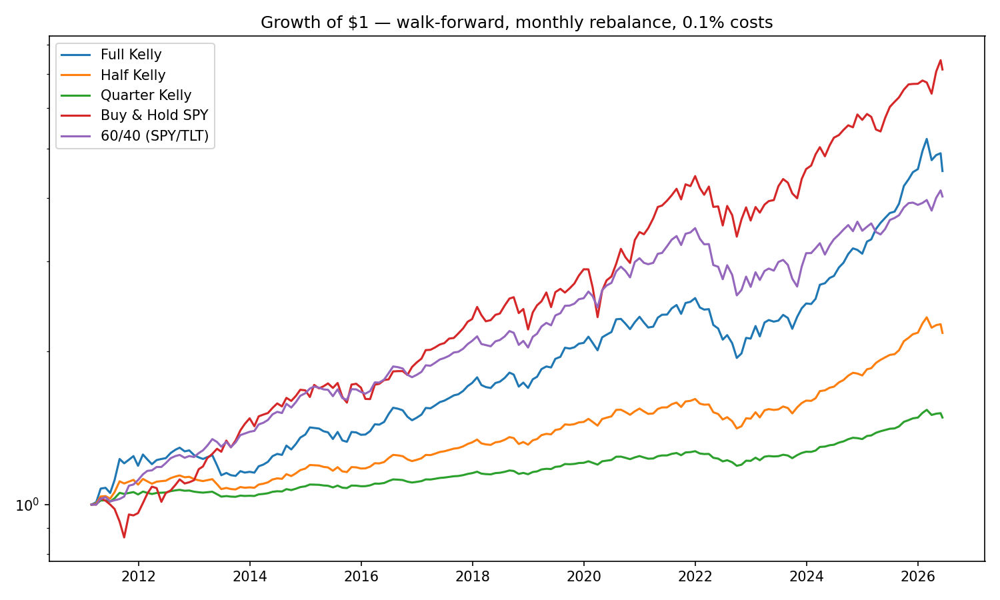

# Kelly Portfolio Lab


From thesis to tool: this repo turns my capstone — *Maximizing Long-Term
Investment Growth: A Study of the Kelly Criterion's Portfolio Applications* —
into a working ETF allocator. It estimates Kelly-optimal portfolio weights from
market data, backtests them walk-forward against standard benchmarks, and
prints the allocation I actually use for my own account each month.

## Results



| Strategy | CAGR | Max Drawdown | Sharpe |
|---|---|---|---|
| Full Kelly | 10.4% | -23.7% | 0.81 |
| Half Kelly | 5.2% | -12.5% | 0.61 |
| Quarter Kelly | 2.6% | -6.4% | 0.23 |
| Buy & Hold SPY | 13.7% | -23.9% | 0.83 |
| 60/40 (SPY/TLT) | 9.5% | -26.2% | 0.76 |

*Walk-forward, monthly rebalance, 0.1% transaction costs, SPY/TLT/GLD universe,
all strategies aligned to the same start date (≈2011, after the 5-year
estimation warm-up). Regenerate with `python scripts/make_charts.py`.*

The honest read: in a window dominated by a historic US equity bull market,
nothing beats 100% SPY on raw growth — and this README doesn't pretend
otherwise. What the Kelly portfolio delivers is **growth comparable to SPY with
the same or less drawdown while diversified across three assets**, and a clean
dial (the Kelly fraction) that trades growth for downside protection: every
halving of the fraction roughly halves the maximum drawdown. Full Kelly beats
the classic 60/40 portfolio on growth, drawdown, *and* Sharpe.

The full narrative — including why over-betting Kelly is fatal and how fragile
the inputs are — is in the
[story notebook](notebooks/kelly_story.ipynb).

## Methodology (the part to be skeptical about)

- **No look-ahead, by construction.** The backtest engine hands each strategy
  only the prices up to the rebalance date (`weight_fn(prices.loc[:t])`); a
  test asserts the strategy never sees a future row.
- **Fractional Kelly applied after the no-leverage constraint.** "Half Kelly"
  means holding half of the constrained Kelly portfolio in assets and half in
  cash — applying the fraction before the constraint lets renormalization erase
  it (full and half Kelly become identical), a subtle bug this repo had and
  fixed, with a regression test.
- **Costs included.** 0.1% of turnover charged at every monthly rebalance.
- **Estimates are honest about being weak.** Expected returns come from
  historical means over a 60-month lookback. This is the noisiest estimator in
  finance and the weights are very sensitive to it (demonstrated in the
  notebook) — which is precisely the capstone's argument for betting a
  *fraction* of Kelly.

## How to run

```bash
pip install -e ".[dev]"

# Today's suggested allocation for a $10,000 portfolio
python -m kellyfolio report --value 10000

# Regenerate the backtest chart and metrics
python scripts/make_charts.py

# Run the test suite (synthetic data only — no network needed)
pytest
```

Tickers, lookback, costs, and the Kelly fraction live in
[config.yaml](config.yaml).

## Project structure

```
src/kellyfolio/
├── data.py       # price download with offline cache fallback
├── estimate.py   # annualized mu and covariance from a lookback window
├── kelly.py      # the Kelly formula + fraction + long-only constraint
├── backtest.py   # walk-forward engine, costs, CAGR/drawdown/Sharpe
└── report.py     # today's target allocation (CLI: python -m kellyfolio)
```

Every module is one idea and under 100 lines.

## Limitations

- Expected-return estimation error dominates everything else (see notebook).
- No taxes, no bid-ask spreads, monthly granularity only.
- The ETF universe (SPY/TLT/GLD) was chosen knowing it survived — survivorship
  bias at the universe level.
- The aligned test window is mostly a bull market; results in other regimes
  will differ.

## Roadmap

- **Phase 2:** Streamlit dashboard for interactive exploration.
- **Phase 3:** Alpaca paper-trading integration; real money only if the paper
  demo holds up.
- Shrinkage estimators (Ledoit–Wolf) for the covariance matrix and
  shrunk/capped expected returns.
